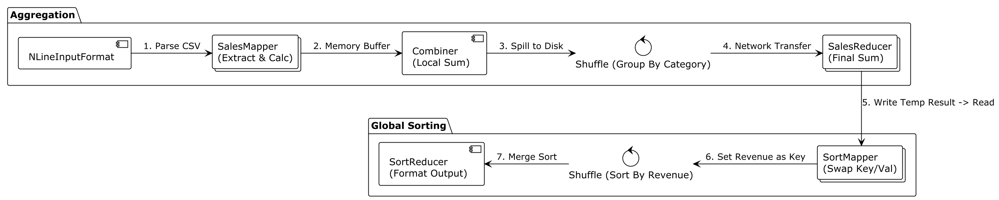

# Hadoop Distributed Sales Analytics

The system processes raw CSV transaction logs to generate business insights such as Total Revenue and Sales Volume per
category. Crucially, it performs a Global Sort by revenue in descending order, utilizing a multiphase MapReduce
pipeline.

## 🏗 Architecture

The processing pipeline is divided into two logical phases connected via HDFS intermediate storage.

### Phase I: Data Aggregation

The goal of this phase is to compress raw transactions into category summaries using horizontal scaling.

#### 1.1 Input Splitting Strategy

- Component: Splitter (InputFormat)
- Logic: The system utilizes NLineInputFormat to slice input CSV files based on line count. Each split spawns a
  dedicated
  Mapper process.
- Scalability: This approach ensures automatic horizontal scaling across the cluster. Note: A dedicated JVM is launched
  for each split; thus, file size and split configuration are crucial for performance to avoid overhead from "small
  files"
  problem.

#### 1.2 SalesMapper

- Logic: Reads raw lines provided by the Splitter. It filters out CSV headers and parsing errors.
- Output: Generates a key-value pair where the Key is the Category and the Value is a custom SalesWritable object (
  containing Revenue and Quantity).

#### 1.3 Combiner Optimization (Local Aggregation)

- Logic: To optimize network bandwidth, a Combiner is executed locally on each Mapper node. It performs the reduction
  logic (summation) on the data residing in the Mapper's memory/disk before sending it over the network.
- Benefit: Drastically reduces the volume of data shuffled across the cluster.

#### 1.4 CategoryPartitioner

- Logic: Ensures that all records belonging to the same Category are routed to the same physical Reducer instance. It
  implements standard Hash-based partitioning logic on the Key.

#### 1.5 SalesReducer

- Logic: Receives grouped data for specific categories and computes the final sums.
- Scaling: configured via aggregationJob.setNumReduceTasks(N).
- Output consists of N part-files located in HDFS, each containing a portion of the aggregated data.

### Phase II: Global Sorting

The goal of this phase is to order the categories by revenue.

#### 2.1 SortMapper (Key Swapping)

- Input: Reads the aggregated results from Phase I.
- Logic: Swaps the Key and Value. Now, Revenue becomes the Key, and Category becomes the Value. This forces Hadoop to
  sort
  records by Revenue during the Shuffle phase.
- Comparator: A custom DescendingDoubleComparator is implemented to ensure the sort order is descending (Highest Revenue
  first).

#### 2.2 SortReducer (Singleton)

- Logic: Receives the sorted stream of data, formats it into a readable report, and writes to HDFS.
- Constraint: This job is strictly configured with 1 Reducer (setNumReduceTasks(1)). This is required to guarantee a
  total global order across the entire dataset.

### Technical Deep Dive: The Shuffle & Sort Mechanism

#### 3.1 Mapper-Side Sort (Spilling)

Before data leaves the Mapper, it undergoes a local sort in memory:

- `context.write` serializes data into a circular memory buffer.
- When the buffer reaches a threshold (spill percent), data is partitioned and sorted via QuickSort in memory.
- Sorted partitions are "spilled" to the local disk.
- Before the Mapper exits, multiple spill files are merged into a single partitioned index file using MergeSort.

#### 3.2 Reducer-Side Sort (Merge)

- The Reducer fetches its specific partitions from all Mappers over HTTP.
- It performs a multi-way MergeSort on these incoming segments.
- The merge often happens in a streaming fashion, feeding directly into the `reduce()` method without creating a
  monolithic sorted file on disk, ensuring memory efficiency.

## 🛠 Setup & Deployment

The project includes a fully configured pseudo-distributed Hadoop environment.

Step-by-step instructions on how to build the JAR, start the Docker cluster, and deploy the
application in [Setup Guide](docs/SETUP.md)

## 📈 Performance Benchmarking

[Benchmark Results](./results/results.md) – Analysis of execution time relative to Worker count, Input Split
sizes and combiner optimization.
