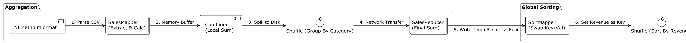

# Описание процесса

## 1. Агрегация данных по категориям

### 1.1 Splitter

Hadoop читает csv файлы, поданные ему на вход, и нарезает их на кусочки.

На данный момент используется NLineInputFormat (нарезка по числу строк), каждый кусочек - свой отдельный mapper.

Под каждый файл также создается отдельный mapper-процесс, поэтому много мелких файлов будет работать неэффективно.

Создание нескольких mapper'ов обеспечивает автоматическое горизонтальное масштабирование.

### 1.2 SalesMapper

Читает полученные от Splitter строки csv файла, отбрасывает заголовок csv и создает специальный
объект SalesWritable, содержащий выручку и число продаж. В качестве ключа использует категорию товара.

### 1.3 SalesReducer Combiner

Из-за того, что нам нужна суммарная выручка и сумма продаж мы можем применить локальную оптимизацию на mapper ноде -
Combiner.

Combiner выполняется после каждого mapper'а и локально выполняет работу reducer'а,
что позволяет снизить объем данных, которые необходимо передать по сети/сбросить на диск.

### 1.4 CategoryPartitioner

Для того, чтобы все записи с одной категорией попали в один reducer, мы используем Partitioner.

CategoryPartitioner - это копия HashPartitioner, который просто считает хеш-функцию от ключа (категории) и выбирает
нужный reducer.

### 1.5 SalesReducer

Суммирует данные для каждой категории и сохраняет результаты в hdfs.

SalesReducer масштабируется горизонтально через конфигурацию `aggregationJob.setNumReduceTasks(4)`.

В результате выполнения в hdfs будет лежать несколько файлов `part-r-00000..N`, с результатами выполнения каждого из
экземпляров reducer'а.

## 2. Сортировка данных

### 2.1 SortMapper

Читает сжатые по категориям результаты первого этапа и меняет ключ с категории на выручку для того, чтобы hadoop
выполнил сортировку по ней.

Автоматически масштабируется hadoop, по размеру и числу файлов на вход.

Для реализации сортировки по убыванию реализован `DescendingDoubleComparator`.

## 2.2 SortReducer

Получает отсортированные данные и записывает их в hdfs.

**Важно**: это финальный результат, поэтому reducer запущен в одном экземпляре.

# Подробнее про сортировку (Shuffle & Sort)

Сортировка работает интересно, поэтому вынесу отдельно.

## Локальная сортировка на стороне mapper'а

Перед тем как данные покинут mapper и пойдут по сети в reducer/на диск, они сортируются локально в памяти mapper'а.

1. При выполнении context.write данные попадают в циклический буффер в памяти mapper'а.
2. Когда буффер заполняется на X процентов, данные делятся на партиции (для каждого reducer'а своя), каждая партиция
   сортируется через quicksort и сбрасывается на диск (spill).
3. Перед завершением mapper'а склеивает данные из нескольких spill'ов в один файл, применяя mergesort.

## Глобальная сортировка на стороне reducer'a

1. Reducer получает от каждого mapper'а кусочек локально отсортированных данных.
2. Reducer сортирует данные в памяти, используя mergesort. При этом сортировка происходит в потоковом режиме, в базовом
   случае, не создавая огромный файл `large-globally-sorted-file`.
