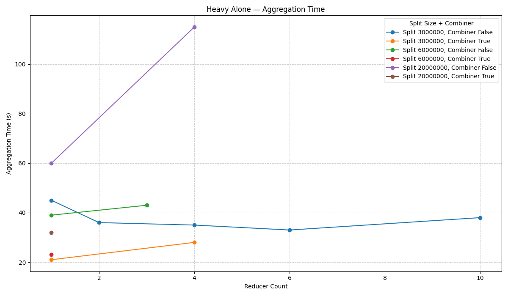
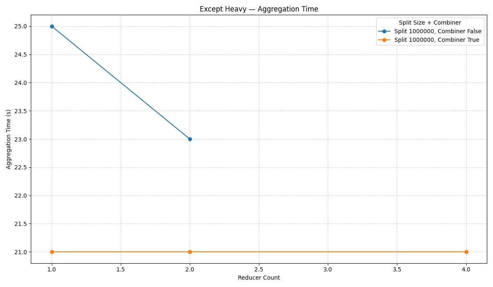

# Heavy alone

About 16_000_000 of lines (500MB).

| Split Size | Number of Splits | Reducer Count | Combiner flag | Aggregation Time (s) | Sorting Time (s) |
|------------|------------------|---------------|---------------|----------------------|------------------|
| 3_000_000  | 6                | 4             | true          | 28                   | 23               |
| 3_000_000  | 6                | 1             | true          | 21                   | 23               |
| 3_000_000  | 6                | 1             | false         | 45                   | 22               |
| 3_000_000  | 6                | 4             | false         | 35                   | 21               |
| 3_000_000  | 6                | 2             | false         | 36                   | 21               |
| 3_000_000  | 6                | 6             | false         | 33                   | 23               |
| 3_000_000  | 6                | 10            | false         | 38                   | 27               |
| 6_000_000  | 3                | 1             | true          | 23                   | 23               |
| 6_000_000  | 3                | 1             | false         | 39                   | 23               |
| 6_000_000  | 3                | 3             | false         | 43                   | 23               |
| 20_000_000 | 1                | 1             | false         | 60                   | 22               |
| 20_000_000 | 1                | 4             | false         | 115                  | 22               |
| 20_000_000 | 1                | 1             | true          | 32                   | 24               |

**Results**

The best performance was achieved using a combiner with a single reducer.
This is because the operations are associative and commutative, making them suitable for combiner optimization.
Additionally, the small number of categories allowed efficient processing with just one reducer.

# Everything except heavy

8 small files, meaning at least 8 mappers will be used.

| Split Size     | Number of Splits | Reducer Count | Combiner flag | Aggregation Time (s) | Sorting Time (s) |
|----------------|------------------|---------------|---------------|----------------------|------------------|
| 1_000_000      | 8                | 1             | true          | 21                   | 25               |
| 1_000_000      | 8                | 2             | true          | 21                   | 22               |
| 1_000_000 TODO | 8                | 4             | true          | 21                   | 22               |
| 1_000_000      | 8                | 1             | false         | 25                   | 21               |
| 1_000_000      | 8                | 2             | false         | 23                   | 23               |

**Results**
Combiner + 1 reducer is still the best option in terms of performance/resources usage.
